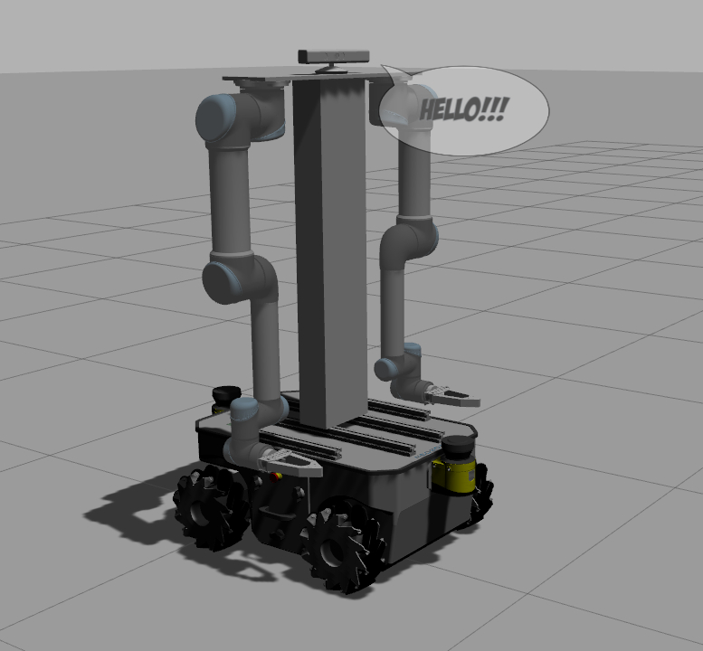
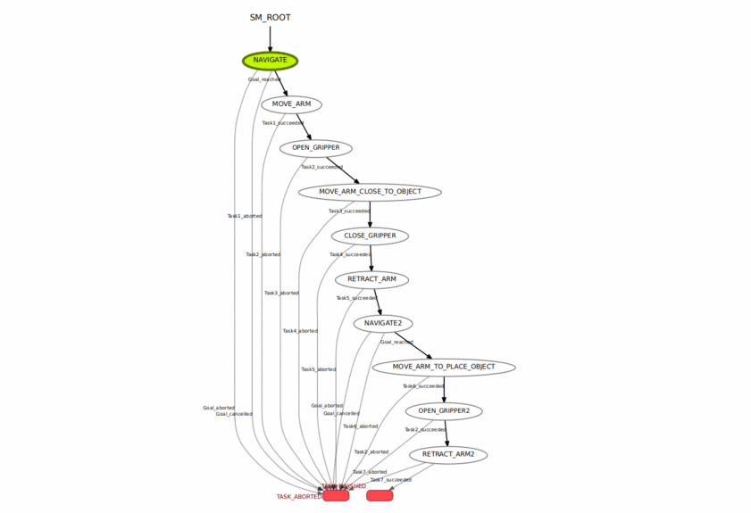

## Neo

Meet Neo, a pseudo humanoid made from two UR5s and Neobotix mobile base (MPO_500) with a Microsoft Kinect mounted as it's head. The robot's arms are configured with MoveIt to perform all the motion planning while the mobile base is loaded with the navigation stack to perform SLAM, Dynamic obstacle avoidance and path planning. 

 To illustrate Neo's capabilities, a python script which performs a simple place and place maneuver has been added in the scripts folder. This script sends a navigation goal to the robot to reach a location near a table with an object on it. On reaching the table the robot identifies the object's location on the table using the Kinect sensor and picks up the object. Following this, it navigates to another table, placed adjacent to the first one, and places the object on it.





-----


#### INSTALLATION

1. Install ROS (Neo has been tested on ROS Melodic, so it is recommended to install the same ROS Distro). If you haven't already installed it install it from the link provided below:-

   ROS Melodic install link:  [http://wiki.ros.org/melodic/Installation/Ubuntu]

   Update your packages by executing the following commands:-

   ```
   rosdep update
   sudo apt-get update
   sudo apt-get dist-upgrade
   ```

   

2. Create a workspace and install dependencies.

   ```
   mkdir ~/neo_ws/src
   cd ~/neo_ws/src
   rosdep install -y --from-paths src --ignore-src --rosdistro ${ROS_DISTRO}
   ```


3. Clone this repository ,configure the catkin package and make it.

   ```
   git clone 
   catkin config --extend /opt/ros/${ROS_DISTRO} --cmake-args -DCMAKE_BUILD_TYPE=Release
   catkin_make
   ```

   

-----

#### BRINGING UP NEO

Launch the gazebo simulation in a terminal 1:-

```
roslaunch neo_simulation mpo_500_simulation_basic.launch
```


By default the map is already created using the gmapping package. By running the following command you would load the map server along with AMCL and Move base node to navigate the humanoid. Run the command below in terminal 2:-

```
roslaunch neo_simulation mpo_500_autonomous_navigation.launch
```


Launch the move_group node and start MoveIt in terminal 3:-

```
roslaunch neo_simulation moveit_neo.launch
```


In a new terminal run the neo_smach python script. This script uses hierarchical state machines to establish a task level architecture.

```
rosrun neo_simulation neo_smach.py
```

 For more information visit: [http://wiki.ros.org/smach/Tutorials]


-----

#### VIDEO

Watch Neo in action!!!

<video src="video/NEO_Pick_and_Place.mp4" width="720" height="480" controls preload></video>


-----

#### SMACH VIEWER

To visualise Smach states of the Pick and Place script execute:-

```
rosrun smach_viewer smach_viewer.py 
```


